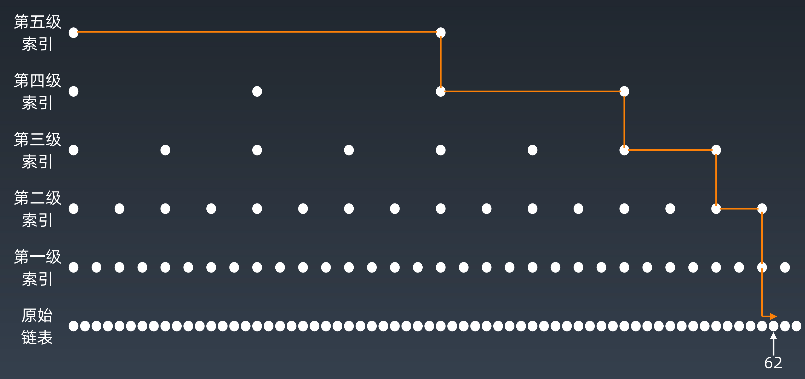

# Array，LinkedList，SkipList

## Array 时间复杂度

- Prepend, Append：O(1)
- Insert, Delete：O(n)
- Lookup：O(1)

## 链表的时间复杂度

- Prepend, Append：O(1)
- Lookup：O(n)
- Insert, Delete：O(1)

## 跳表：SkipList

跳表是基于链表的数据结构优化之后的一种数据结构。

### 跳表是如何对链表进行优化的

在链表的基础上，跳表增加了多级索引，查找元素时，从最顶层索引一直向下找，直到查找到该元素。



### 跳表时间复杂度分析

第一级索引的个数为 n/2，第二级索引的个数为 n/4，由此类推，第 k 级索引的格式就是 n/(2^k)。假设索引有 h 级，最高级的索引有 2 个结点。n/(2^h) = 2，从而求得 h = log2(n)-1。

以上可得知，索引的高度为 logn，每层最多遍历的节点个数为 3。所以在跳表中查询任意数据的时间复杂度就是 O(logn)。

### 跳表空间复杂度分析

原始链表大小为 n，每 2 个结点抽 1 个，每层索引的结点数：
$$
\frac{n}{2}, \frac{n}{4}, \frac{n}{8}, ... ,8, 4, 2
$$
原始链表大小为 n，每 3 个节点抽 1 个，每层索引的节点数：
$$
\frac{n}{3}, \frac{n}{9}, \frac{n}{27}, ... , 9, 3, 1
$$
每层索引的个数相加，无线接近于 n。所以空间复杂度是 O(n)。

## 总结

- 熟悉数组，链表，跳表是如何实现的
- 牢记三者的时间复杂度，空间复杂度
- 工程中的应用：LRU Cache(Linked List)，Redis(Skip List)
- 跳表：升维思想，用空间来换时间


# 实战项目

## Move Zeroes

记录 0 的位置，将非 0 元素与 0 元素互换。

### 题解

```java
class Solution {
    public void moveZeroes(int[] nums) {
        // assume it's 0's index
        int j = 0;
        for (int i = 0; i < nums.length; i++) {
            if (nums[i] != 0) {
                // nums[i] != 0, change nums[i]'s value into nums[j] which the value is 0;
                // the case that nums[j] == nums[i] != 0 exists.
                nums[j] = nums[i];
                if (i != j) {
                    // So judge if i equals j or not
                    // i doesn't equals j, set 0 into nums[i]'s value
                    nums[i] = 0;
                }
                j++;
            }
        }
    }
}
```

## Container with Most Water

最左和最右双指针方法。很简单的一道 Medium 难度的题，不需要说明了。

### 题解

```java
class Solution {
    public int maxArea(int[] height) {
        int max = 0;
        for (int i = 0, j = height.length - 1; i < j;) {
            int area = (j - i) * Math.min(height[i], height[j]);
            max = Math.max(max, area);
            if (height[i] < height[j]) {
                i++;
            } else {
                j--;
            }
        }
        return max;
    }
}
```

时间复杂度：`O(n)`

## Climbing Stairs

重复最近子问题。爬楼梯的问题相当于一个Fibonacci数列，直接用Fibonacci数列的思想来解决即可。

- Fibonacci 数列的几种解法

  - 递归：
    $$
    时间复杂度：O(2^n) \quad 空间复杂度：O(1)
    $$
  
- 数组： 
    $$
    时间复杂度：O(n) \quad 空间复杂度：O(n)
    $$
    
  - 缓存：
  
  $$
    时间复杂度：O(n) \quad 空间复杂度：O(1)
  $$

### 题解

```java
class Solution {
    public int climbStairs(int n) {
        if (n <= 2) return n;
        int x = 1, y = 2, z = 3;
        for (int i = 3; i <= n; i++) {
            z = x + y;
            x = y;
            y = z;
        }
        return z;
    }
}
```

时间复杂度：`O(n)`

## 3 Sum

目标是找出数组中三个元素满足 `a + b + c = 0`，可以遍历数组，并在循环中使用左右边界的双指针，三个元素加起来为 0，就将这三个元素加入到结果集中。详细可以通过代码来理解：

```java
class Solution {
    public List<List<Integer>> threeSum(int[] nums) {
        List<List<Integer>> result = new ArrayList<>();
        Arrays.sort(nums);
        for (int k = 0; k < nums.length - 2; k++) {
            // k元素为目标数，且k大于0时，则不会有等于0的结果了。
            if (nums[k] > 0) return result;
            // 使用i，j左右边界双指针，i > k
            int i = k + 1, j = nums.length - 1;
            // 重复元素跳过
            if (k > 0 && nums[k] == nums[k - 1]) continue;
            while (i < j) {
                // 若结果大于0，则将j往左移动
                if (nums[i] + nums[j] + nums[k] > 0) {
                    j--;
                } else if (nums[i] + nums[j] + nums[k] < 0) {
                    // 结果小于0，将i向右移动
                    i++;
                } else {
                    // 找到结果集后，将i向右移，j向左移动，继续查找是否还有符合条件的结果。
                    result.add(Arrays.asList(nums[k], nums[i], nums[j]));
                    while(i < j && nums[j] == nums[--j]);
                    while(i < j && nums[i] == nums[++i]);
                }
            }
            // 若该k元素与其他元素均没有符合条件的结果，将k移到下一个元素，继续查找。
        }
        return result;
    }
}
```

时间复杂度：
$$
O(n^2)
$$

# 栈和队列

- Stack：FILO；添加删除操作皆为O(1)，查询为O(n)
- Queue：FIFO；添加删除操作皆为O(1)，查询为O(n)

  ## 双端队列 Deque：Double-End Queue

双端队列是 Stack 和 Queue 的结合，可以从两端添加或者删除数据，添加删除皆为O(1)，查询为O(n)。

## Priority Queue 优先队列

Java 实现的优先级队列：[PriorityQueue\<E\>](https://docs.oracle.com/en/java/javase/11/docs/api/java.base/java/util/PriorityQueue.html)

> An unbounded priority [queue](https://docs.oracle.com/en/java/javase/11/docs/api/java.base/java/util/Queue.html) based on a priority heap. The elements of the priority queue are ordered according to their [natural ordering](https://docs.oracle.com/en/java/javase/11/docs/api/java.base/java/lang/Comparable.html), or by a [`Comparator`](https://docs.oracle.com/en/java/javase/11/docs/api/java.base/java/util/Comparator.html) provided at queue construction time, depending on which constructor is used. A priority queue does not permit `null` elements. A priority queue relying on natural ordering also does not permit insertion of non-comparable objects (doing so may result in `ClassCastException`).
>
> **Note that this implementation is not synchronized.** Multiple threads should not access a `PriorityQueue` instance concurrently if any of the threads modifies the queue. Instead, use the thread-safe [`PriorityBlockingQueue`](https://docs.oracle.com/en/java/javase/11/docs/api/java.base/java/util/concurrent/PriorityBlockingQueue.html) class.

基于优先级堆(priority heap)，默认情况下由元素的自然顺序排序。也可以在构造方法中传一个自定义的 `Comparator` 来排序。

`PriorityQueue` 不允许 `null` 元素，也不允许不可排序的元素 (可能会报错 `ClassCasrException`)。

`PriorityQueue` 不是线程安全的，如果有多线程并发操作的情况，推荐使用 `PriorityBlockingQueue`。

插入操作：O(1)

取出操作：O(logN) - 通过元素的优先级取出，底层数据结构比较复杂

数据结构：heap，BST，treap

## 栈，队列题解Trick

### 栈

- 最近相关性

 ## 改写代码

## PriorityQueue 源码分析

PriorityQueue 不允许空元素，不是线程安全的 (线程安全推荐使用：PriorityBlockingQueue)

### 属性

```java
transient Object[] queue; // non-private to simplify nested class access
```

PriorityQueue 是一个二叉堆 (Binary Heap)，两个子元素为 `queue[2*n+1]` 和 `queue[2*(n+1)]`。PriorityQueue 中的元素是由 comparator 来排序的，comparator 是构造 PriorityQueue 时可传的参数，如果为 null，则使用默认排序 - 元素的自然排序。

```java
int size; // priority queue 中的元素个数，与 ArrayList 类似

private final Comparator<? super E> comparator;

// 最大元素个数为什么是 MAX_VALUE - 8 呢？
// 源码中的注释解释了，有些 VM 会在数组中保留对象头的空间 (head words)
private static final int MAX_ARRAY_SIZE = Integer.MAX_VALUE - 8;
```

### 构造方法

```java
private static final int DEFAULT_INITIAL_CAPACITY = 11; // 默认初始化容量
// 构造方法
/**
 * 1、默认无参构造方法默认容量为11
 */
public PriorityQueue() {
    this(DEFAULT_INITIAL_CAPACITY, null);
}
/**
 * 2、构造方法参数为初始化容量
 */
public PriorityQueue(int initialCapacity) {
    this(initialCapacity, null);
}
/**
 * 3、构造方法参数为 Comparator，用来对比元素优先级
 */
public PriorityQueue(Comparator<? super E> comparator) {
    this(DEFAULT_INITIAL_CAPACITY, comparator);
}
/**
 * 4、2和3构造方法的合体
 */
public PriorityQueue(int initialCapacity,
                     Comparator<? super E> comparator) {
    // Note: This restriction of at least one is not actually needed,
    // but continues for 1.5 compatibility
    if (initialCapacity < 1)
        throw new IllegalArgumentException();
    this.queue = new Object[initialCapacity];
    this.comparator = comparator;
}
```

```java
/**
 * 5、初始化队列元素，传入一个集合
 */
public PriorityQueue(Collection<? extends E> c) {
    if (c instanceof SortedSet<?>) {
        SortedSet<? extends E> ss = (SortedSet<? extends E>) c;
        this.comparator = (Comparator<? super E>) ss.comparator();
        initElementsFromCollection(ss);
    }
    else if (c instanceof PriorityQueue<?>) {
        PriorityQueue<? extends E> pq = (PriorityQueue<? extends E>) c;
        this.comparator = (Comparator<? super E>) pq.comparator();
        initFromPriorityQueue(pq);
    }
    else {
        this.comparator = null;
        initFromCollection(c);
    }
}
```

5、该构造方法中传入的 `Collection` 如果是是 `SortedSet` 和 `PriorityQueue` 或其子类，则初始化 comparator，否则默认 comparator 为空，然后从传入的集合中初始化元素。

### 主要方法

内部维护了一个 Object 数组，所有的操作通过操作 Object 数组完成。

初始化时，会通过初始化方法调用 `heapify` 将数组初始化为堆。

#### 扩容

```java
private void grow(int minCapacity) {
    int oldCapacity = queue.length;
    // 小于64，双倍扩容；否则扩容50%
    int newCapacity = oldCapacity + ((oldCapacity < 64) ?
                                     (oldCapacity + 2) :
                                     (oldCapacity >> 1));
    // overflow-conscious code
    // 扩容之后检测是否大于最大容量
    if (newCapacity - MAX_ARRAY_SIZE > 0)
        newCapacity = hugeCapacity(minCapacity);
    queue = Arrays.copyOf(queue, newCapacity);
}
```

1. 当数组比较小时（小于64），双倍扩容
2. 当数组容量较大时，扩容50%

#### 添加元素

添加元素有两个方法：`add(E e)` 和 `offer(E e)`

```java
public boolean add(E e) {
    return offer(e);
}
public boolean offer(E e) {
    if (e == null)
        throw new NullPointerException();
    modCount++;
    int i = size;
    if (i >= queue.length)
        grow(i + 1);
    siftUp(i, e);
    size = i + 1;
    return true;
}
private void siftUp(int k, E x) {
    if (comparator != null)
        siftUpUsingComparator(k, x, queue, comparator);
    else
        siftUpComparable(k, x, queue);
}

private static <T> void siftUpComparable(int k, T x, Object[] es) {
    Comparable<? super T> key = (Comparable<? super T>) x;
    while (k > 0) {
        // 找到父节点
        int parent = (k - 1) >>> 1;
        Object e = es[parent];
        // 如果比父节点大，跳出循环，不继续操作
        if (key.compareTo((T) e) >= 0)
            break;
        // 比父节点小，就与父节点交换位置，继续向上比较，直到比父节点大
        es[k] = e;
        k = parent;
    }
    es[k] = key;
}
```

1. 判断元素是否为空，空则报空指针异常（队列中的元素不允许为空）
2. 修改次数加1
3. 判断是否需要扩容，如果数组长度不够了，先扩容
4. 插入到最后一个元素的后一个位置
5. `siftUp` 通过 comparator 将元素放进合适的位置 (通过优先级排序)
6. 从最底处向上堆化，比父节点小则交换位置，直到比父节点大。由此可见，PriorityQueue 是一个**小顶堆**
7. 队列元素个数加一

#### 移除元素

因为内部维护的是数组，实际是是通过数组下标来删除元素，并将数组重新排序。

```java
public E remove() {
    E x = poll();
    if (x != null)
        return x;
    else
        throw new NoSuchElementException();
}
public E poll() {
    final Object[] es;
    final E result;

    if ((result = (E) ((es = queue)[0])) != null) {
        modCount++;
        final int n;
        final E x = (E) es[(n = --size)];
        es[n] = null;
        if (n > 0) {
            final Comparator<? super E> cmp;
            if ((cmp = comparator) == null)
                siftDownComparable(0, x, es, n);
            else
                siftDownUsingComparator(0, x, es, n, cmp);
        }
    }
    return result;
}
private static <T> void siftDownComparable(int k, T x, Object[] es, int n) {
    // assert n > 0;
    Comparable<? super T> key = (Comparable<? super T>)x;
    // 只需要比较一半，叶子结点占了一半，不需要比较叶子结点。
    int half = n >>> 1;           // loop while a non-leaf
    while (k < half) {
        // 寻找子节点，当前节点*2+1
        int child = (k << 1) + 1; // assume left child is least
        Object c = es[child];
        int right = child + 1;
        if (right < n &&
            ((Comparable<? super T>) c).compareTo((T) es[right]) > 0)
          	// 取左右子节点中小的一个
            c = es[child = right];
      	// 如果比子节点小，则不继续操作
        if (key.compareTo((T) c) <= 0)
            break;
        es[k] = c;
      	// 指针移到子节点，继续比较
        k = child;
    }
    es[k] = key;
}
```

1. remove 方法内部也是调用 poll 方法，只不过元素为 null 时报错
2. 自上到下堆化，一直向下与最小的子节点比较
3. 如果比最小的子节点大，交换位置，再继续与最小的子节点比较
4. 直到比最小的子节点小，就不需要继续交换。

### 总结

- PriorityQueue 是一个小顶堆
- 非线程安全
- 入队和出队都是对堆的插入和删除操作实现